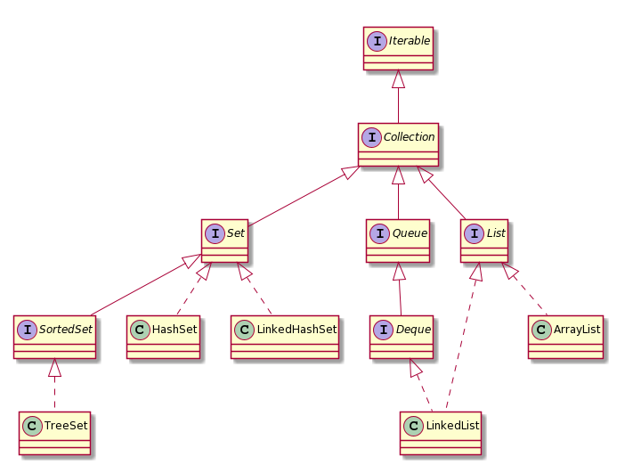
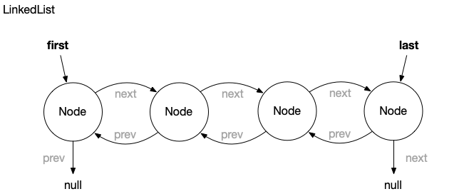
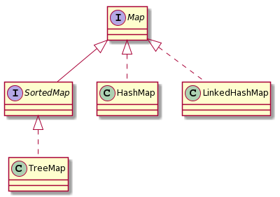

# ProPra I Zusammenfassung

# Woche 1

## Die Java Klassenbibliothek

### Collection
Folgendes Bild ist ein UML-Klassendiagramm (Interfaces I, Klassen C).
Ein gestrichelter Pfeil ist eine Implementierungsbeziehung (bsp. LinkedList implements Interface List und Deque).
Ein durchgezogener Pfeil ist eine Erweiterungsbeziehung (bsp. SortedSet extends Interface Set).
Eine Erweiterungsbeziehung kann auch zwischen Klassen bestehen, ist auf diesem Diagramm allerdings nicht vorhanden.



Das Basis-Interface ist Collection. Dort sind Methoden definiert, die für alle sequenzartigen Kollektionen sinnvoll sind:
- `add` und `addAll`, um Elemente in die Kollektion einzufügen
- `remove`, `removeAll`, `removeIf`, `retainAll` und `clear`, um Elemente zu löschen
- `contains` und `containsAll`, um herauszufinden, ob Elemente in der Kollektion vorhanden sind
- `size` und `isEmpty`, um die Anzahl der Elemente abzufragen, bzw. herauszufinden, ob eine Kollektion leer ist.
- `toArray` und `stream` um die Kollektion in ein Array bzw. einen Stream zu konvertieren

Konkrete Klassen implementieren üblicherweise eines der drei spezifischeren Interfaces `List`, `Set` und `Queue`.

### List
Das List-Interface ist für Kollektionen gedacht, bei denen Elemente geordnet positioniert sind.
Elemente sind nicht sortiert, sondern haben haben eine bestimmte Position in der Kollektion und können mehrfach vorkommen.

Wesentliche Methoden die `List` zusätzlich zu `Collection` spezifiziert, sind
- `get`, um ein Element, das an einer bestimmten Position in der Liste gespeichert ist, zu lesen
- `set`, um ein Element, das an einer bestimmten Position in der Liste gespeichert ist, zu überschreiben

`List` stellt außerdem eine zusätzliche Variante von `add` bereit:
```java
List<Integer> ints = init(); //Liste mit Werten erzeugen
ints.add(1, 6); //fügt an Position 1 den Wert 6 ein
```
Mit `of` lässt sich eine Liste direkt erzeugen die sich im Nachhinein nicht mehr ändern lässt.
Eine solche Methode, die kein Konstruktor ist, nennt man statische Factorymethode.

```java
List<Integer> numbers = List.of(2,3,4,5,6,7,8,9,16);
System.out.println(numbers); // => [2,3,4,5,6,7,8,9,16]
numbers.add(23); // => Exception java.lang.UnsupportedOperationException
```

#### ArrayList
`ArrayList` verwendet intern ein Array zur Datenspeicherung somit ist Zugriff per Index sehr effizient.
Einfügen von Elementen an einer beliebeigen Stelle ist hingegen teuer, da alle Elemente an Folgepositionen verschoben werden müssen.
Wenn das Array voll ist weid ein neues mit min. 50% größerer Kapazität erzeugt und das alte Array umkopiert.

`ArrayList` Beispiel:
```java
List<String> names = new ArrayList<>();
// Beobachtung 1: Der Typ der Variablen kann eine Superklasse vom erzeugten Typ sein oder ein Interface, das die Klasse implementiert (das kennen Sie schon von den Flying Objects aus der Programmierung).
// Beobachtung 2: Die Collection-Klassen sind parametrisiert, hier mit String.
// Beobachtung 3: Sie müssen den Typ-Parameter bei der Instanziierung auf der rechten Seite in den spitzen Klammern seit Java 7 nicht wiederholen.

System.out.println(names); // => []

// Ein erstes Element wird eingefügt, Rückgabe ist true, wenn es erfolgreich war
System.out.println(names.add("Java Mc Javaface")); // => true

names.add("James Gossling"); // => true

// ArrayList zählt intern mit, der Aufruf ist billig (schnell)!
System.out.println(names.size()); // => 2

System.out.println(names); // => [Java Mc Javaface, James Gossling]

// Einfügen in der Mitte. Das kann teuer (langsam) werden, wenn eine ArrayList viele Elemente beinhaltet!
names.add(1, "Brian Goetz");

System.out.println(names); // => [Java Mc Javaface, Brian Goetz, James Gossling]

// Beim Überschreiben bekommen wir den überschriebenen Wert zurück
System.out.println(names.set(0, "Joshua Bloch")); // => "Java Mc Javaface"

System.out.println(names); // => [Joshua Bloch, Brian Goetz, James Gossling]

ArrayList<String> javaleute = new ArrayList<>();

// Alle Elemente einer Liste in eine andere einfügen
System.out.println(javaleute.addAll(names)); // => true

// Alle Elemente entfernen
names.clear();

System.out.println(names); // => []
System.out.println(javaleute); // => [Joshua Bloch, Brian Goetz, James Gossling]
```

#### LinkedList
`LinkedList` ist eine doppelt verkettete Liste (jeder Knoten hat eine Referenz auf Vorgänger und Nachfolger)



Vorteile einer doppelten Verkettung:
- Man kann schnell von vorne nach hinten und von hinten nach vorne durch Listenelemente iterieren
- Man kann hinten und vorne effizient (in konstanter Zeit) Elemente einfügen und entfernen

`LinkedList` eignet sich aufgrund ihrer Eigenschaften gut als Implementierung für das Queue- und Deque-Interface. Ist aber nicht gut geeignet als Liste (man verwendet dafür `ArrayList`).
`LinkedList` wird häufig als Implementierung für einen Stack oder Queue verwendet.

### Queue
Das `Queue`-Interface spezifiziert Methoden, die man bei einer Queue-Implementierung erwartet:
- `offer` zum einfügen in Queue
- `peek` zum anschauen des nächsten Elements ohne es zu entfernen
- `poll` zum entfernen des nächsten Elements

`LinkedList` ist eine Implementierung einer FIFO-Queue (Elemente hinten einfügen und vorne entfernen).

Beispiel:
```java
Queue<String> q = new LinkedList<>();

q.offer("a");
q.offer("b");
q.offer("c");

System.out.println(q); // => [a, b, c]
System.out.println(q.peek()); // => a
System.out.println(q); // => [a, b, c]
System.out.println(q.poll()); // => a
System.out.println(q); // => [b, c]
```
Die Implementierung für `Deque` mit `LinkedList` ist ähnlich:
- `offerFirst`, `offerLast` zum einfügen vorne oder hinten in Queue (analog für die anderen Methoden)
- `push` um Element auf den Stack zu legen
- `pop` um Element vom Stack zu holen

Stacks haben ein LIFO-Verhalten.

Beispiel:
```java
Deque<String> stack = new LinkedList<>();

stack.push("x");
stack.push("y");
stack.push("z");

System.out.println(stack); // => [z, y, x]
System.out.println(stack.peek()); // => z
System.out.println(stack); // => [z, y, x]
System.out.println(stack.pop()); // => z
System.out.println(stack); // => [y, x]
```

### Set
In einem `Set` gibt es keine doppelten Elemente ähnlich wie bei einer Menge in der Mathematik.
Eine häufige Implementierung ist das `HashSet`:
```java
Set<Integer> ints = new HashSet<>();
ints.addAll(List.of(3,4,5,6,7,8,9,16));
System.out.println(ints); // =>  [16, 3, 4, 5, 6, 7, 8, 9]
```
Eine Klasse die nur `Set` aber nicht `SortedSet` implementiert gibt es keine Garantie in welcher Reihenfolge Elemente durchlaufen werden, daher sollten keine Annahmen über die Reihenfolge gemacht werden.

Wenn eine bestimmte Reihenfolge nötig ist verwendet man Klassen die `SortedSet` implementieren.
Entweder kann man eine Instanz des `Comparator`-Interfaces benutzen oder die natürliche Reihenfolge (definiert für alle Datentypen die das `Comparable`-Interface implementieren wie z.B. `Integer` oder `String`).
Eine Klasse die `SortedSet` implementiert, ist `TreeSet`:

```java
Set<Integer> ints = new TreeSet<>();
ints.addAll(List.of(7,6,4,9,3,8,16,5));
System.out.println(ints); // =>  [3, 4, 5, 6, 7, 8, 9, 16]
```
Natürliche Reihenfolge mit Comparator:

```java
// erstellt ad hoc ein Objekt einer "anonymen" (namenlosen) Klasse, die das Comparator-Interface implementiert
Comparator<Integer> evenFirstComparator = new Comparator<Integer>() {
  @Override
  public int compare(Integer o1, Integer o2) {
    if (o1 % 2 == o2 % 2) {
      // compareTo gibt einen negativen Wert zurück, falls o1 < o2
      return o1.compareTo(o2);
    }
    if (o1 % 2 == 0) {
      return -1;
    } else {
      return 1;
    }
  };
};

SortedSet<Integer> set = new TreeSet<>(evenFirstComparator);
set.addAll(List.of(3,4,5,6,7,8,9,16));
System.out.println(set); // => [4, 6, 8, 16, 3, 5, 7, 9]
set.add(10);
System.out.println(set); // => [4, 6, 8, 10, 16, 3, 5, 7, 9]
set.add(13);
System.out.println(set); // => [4, 6, 8, 10, 16, 3, 5, 7, 9, 13]
```
`Comparator` ist ein funktionales Interface welches die Funktion `compare` implementiert, die zwei Instanzen `a` und `b` des zuvergleichenden Objekts übergeben bekommt. Die Methode gibt einen negativen Wert zurück, wenn `a` bezüglich der Sortierung kleiner ist als `b`, einen positiven im umgekehrten Fall und 0 wenn beide gleich sind.

### Map
Klassen die das `Map`-Interface unterstützen, erben nicht von `Collection`, werden aber auch zur Speicherung von Daten verwendet.
Es werden Schlüssel-Wert-Paare gespeichert.

Es gibt sortierte und unsortierte Maps wobei die Sortierung sich auf die Schlüssel bezieht.



`Map` enthält ähnliche Methoden wie `Collection`:
- `get` und `getOrDefault`, um Werte nachzuschlagen
- `put`, `putAll` und `putIfAbsent`, um Schlüssel-Wert-Paare in die Map einzufügen
- `remove` und `clear`, um Paare zu löschen
- `keySet`, `values` und `entrySet` um eine Kollektion der Schlüssel, Werte bzw. Schlüssel-Wert-Paare zu bekommen
- `of` um unveränderliche Maps zu erzeugen

`HashMap` garantiert keine bestimmte Reihenfolge.
`LinkedHashMap` kann verwendet werden wenn die Einfügereihenfolge beibehalten wird.
`SortedMap` ist ein Interface in dem die Schlüssel in sortierter Reihenfolge vorliegen.

Beispiel:
```java
import java.util.HashMap;
import java.util.LinkedHashMap;
import java.util.Map;
import java.util.TreeMap;

class Customer {

  private final String name;

  private Customer(String name) {
    this.name = name;
  }

  public String toString() {
    return name;
  }

  public static Customer customer(String name) {
    return new Customer(name);
  }

  public static void main(String[] args) {
    Map<Integer, Customer> customers = new HashMap<>();

    customers.put(1, customer("Bill Gates"));
    customers.put(3, customer("Jeff Bezos"));
    customers.put(2, customer("Elon Musk"));

    System.out.println(customers); // => {1=Bill Gates, 2=Elon Musk, 3=Jeff Bezos}

    System.out.println(customers.get(2)); // => Elon Musk
    System.out.println(customers.get(4)); // => null

    System.out.println(customers.getOrDefault(2, customer("Arno Nym"))); // => Elon Musk
    System.out.println(customers.getOrDefault(4, customer("Arno Nym"))); // => Arno Nym

    customers.putIfAbsent(3, customer("Karl Albrecht"));
    System.out.println(customers.values()); // => [Bill Gates, Elon Musk, Jeff Bezos]

    customers.put(3, customer("Karl Albrecht")); // => [Bill Gates, Elon Musk, Karl Albrecht]
    System.out.println(customers.values());

    customers.remove(2);
    System.out.println(customers); // => {1=Bill Gates, 3=Karl Albrecht}

    customers.put(16, customer("Warren Buffett "));
    System.out.println(customers); // => {16=Warren Buffett , 1=Bill Gates, 3=Karl Albrecht}
  }
}
```

### Utility-Klassen
In den zwei Hilfsklassen `Collections` und `Arrays` finden sich eine Reihe nützlicher Hilfsmethoden:

```java
List<String> liste = new ArrayList<>(List.of("Kartoffeln", "Tomaten", "Wasser", "Brot"));
System.out.println(liste); // => [Kartoffeln, Tomaten, Wasser, Brot]

Collections.reverse(liste); // Achtung: Die Originalliste wird verändert!
System.out.println(liste); // => [Brot, Wasser, Tomaten, Kartoffeln]

Collections.sort(liste);
System.out.println(liste); // => [Brot, Kartoffeln, Tomaten, Wasser]

Collections.swap(liste, 0, 2);
System.out.println(liste); // => [Tomaten, Kartoffeln, Brot, Wasser]

Collections.shuffle(liste);
System.out.println(liste); // => Die Liste in zufälliger Reihenfolge

Collections.sort(liste);
Collections.rotate(liste, 1);
System.out.println(liste); // => [Wasser, Brot, Kartoffeln, Tomaten]

Collections.rotate(liste, -2);
System.out.println(liste); // => [Kartoffeln, Tomaten, Wasser, Brot]

Collections.fill(liste, "Bier");
System.out.println(liste); //=> [Bier, Bier, Bier, Bier]
```

Die Klasse `Arrays` enthält viele analoge Funktionen, die den Umgang mit Arrays erleichtern.

### Externe Bibliotheken
Wir wollen Übungsgruppen verwalten und benötigen eine Datenstruktur, um Studierende auf Termine aufzuteilen. Wir können dazu eine Map verwenden, deren Schlüssel die Termine sind und jedem Termin ein Set von Studierenden zuordnen. Vor Java 8 war der notwendige Code ziemlich unangenehm. Wir müssen das zu einem Termin gehörende Set aus dem Map holen. Wenn das Set noch nicht existiert, müssen wir ein neues Set anlegen und können dann z. B. das GitHub-Handle speichern.

```java
public class AwkwardMap {

  private final HashMap<String, Set<String>> zuordnung = new HashMap<>();

  public void add(String termin, String githubHandle) {
    Set<String> handles = zuordnung.get(termin);
    if (handles == null) {
      handles = new HashSet<>();
    }
    handles.add(githubHandle);
  }
}
```

Mit `getOrDefault` wird der Code kompakter

```java
public class AwkwardMap {

  private final HashMap<String, Set<String>> zuordnung = new HashMap<>();


  public void add(String termin, String githubHandle) {
    Set<String> handles = zuordnung.getOrDefault(termin, new HashSet<>());
    handles.add(githubHandle);
  }
}
```
(Funktionen werden in Leifragen gefixed)

Besser ist eine fertige Implementierung einer `MultiMap` zu benutzen (z.B. von Google Guava oder Apache Commons Collection)

```java
public class BetterMap {

  // Verwendet die Bibliothek Apache Commons Collection
  // Wie Sie so eine Bibliothek nutzen, schauen wir uns in der kommenden Woche an
  private final HashSetValuedHashMap<String, String> zuordnung = new HashSetValuedHashMap<>();

  public void add(String termin, String githubHandle) {
    zuordnung.put(termin, githubHandle);
  }
}
```

## Idiomatische Verwendung von Schleifen

Wenn im Code die „passenden“ Sprachkonstrukte zum Erreichen eines Ziels verwendet werden, bezeichnet man den Code als „idiomatisch“.

### Rekursion

Es ist in Java extrem selten eine gute Idee, eine Rekursion zu verwenden. Es lassen sich damit zwar bestimmte Algorithmen 
sehr elegant ausdrücken, aber für jeden rekursiven Aufruf wird in Java auf dem Aufrufstack etwas Speicher benötigt. Wenn der Speicher, den die JVM für den 
Aufrufstack reserviert hat, voll ist, kommt es zu einem StackOverflowError.

### Enhanced For Loop

Diese Schleife wird immer dann verwendet, wenn man über eine Sammlung von Werten iteriert.
Beispiel:

```java
List<Person> studierende = getStudierende();
for(Person p : studierende) {
    System.out.println(p.getAlter());
}
```

Die ForEach Schleife hat weniger bewegliche Teile und ist deswegen weniger Fehleranfällig als normale For Schleifen (z.B. beim Index).
Die foreach-Schleife funktioniert sowohl mit Arrays, als auch mit allen Klassen, die das `Iterable`-Interface implementieren; dies sind insbesondere alle Klassen, die `Collection` implementieren.

### Die ForEach Methode

#### Lambdas

Syntax: (a,b,c) -> { Java Code }
- Keine lokalen variablen als paramternamen
- Ein Parameter: Runde Klammern nicht notwendig
- Nur ein Ausdruck: Geschweifte Klammern und Return sind optional

Beispiel:
```java
(Integer n) -> {return n * n;};
(n) -> {return n * n;};
n -> {return n * n;};
n -> n * n;

(offset, n) -> {
  int[] result = new int[n];
  for (int i = 0; i < n; i++) {
    result[i] = i + offset;
  }
  return result;
};

In Variable Speichern welcher Typ?

ausdruck = (offset, n) -> {
  int[] result = new int[n];
  for (int i = 0; i < n; i++) {
    result[i] = i + offset;
  }
  return result;
};

Passendes Funktionales Interface:

public interface MyInterface {

  List<Integer> berechnen(int offset, int n);

}

==> MyInterface ausdruck = (offset, n) -> {
  int[] result = new int[n];
  for (int i = 0; i < n; i++) {
    result[i] = i + offset;
  }
  return result;
};

List<Integer> berechnen = ausdruck.berechnen(-3, 6);
System.out.println(berechnen);
```
Fertige Funktionale Interfaces in java.util.functions:
- Cunsumer a -> void, BiConsumer (a,b) -> void
- Function a -> b, BiFunction (a,b) -> c 
- Supplier () -> a // Erzeugt Werte (immer gleicher oder neuer Wert) z.B. ArrayList
- Predicate a -> boolean, BiPredicate (a,b) -> boolean
- UnaryOperator a -> a, BinaryOperator (a,a) -> a
- Einige spezialisierte Interfaces für int, long und double

Beispiel ForEach:
```java
List<String> buchstaben = List.of("a","b","c");

buchstaben.forEach(s -> System.out.println(s));
```

### Streams

Streams sind da um Collections zu verarbeiten (z.B. Listen, Arrays, Set)

```java
public static int compute(List<Integer> ns, int k) {
  return ns.stream()
    .filter(x -> x %2 == 0) // nur gerade Werte
    .filter(x -> x > 5) // nur Werte größer 5
    .map(x -> x * x) // Zahlen die durch filter kommen werden quadriert
    .limit(k) // ende Stream nach k elementen
    .reduce(0, (x,y)->x+y); //0 = akkumulator wert (x = 0) y ist wert aus Stream bis                               //alle werte verarbeitet sind
}
```

### Normaler For Loop

`ForEach`-Methoden und Streams bieten nur sequenziellen Zugriff auf ein Element oder Datenstruktur.
Wenn mehr als ein Element gleichzeitig oder ein Index benötigit wird eignet sich die normale For Schleife gut.

```java
List<Person> studierende = getAnmeldeliste();
for(int i = 0; i < studierende.size(); i++) {
    System.out.println("Platz " + (i + 1) + ": " + p.getName());
}
```

Normale Loops bieten mehr Optionen für Iteration, sind aber fehleranfälliger.
Die normale for-Schleife kommt auch dann zum Zuge, wenn wir einen Codeblock mehrfach unabhängig von einer Kollektion ausführen wollen.

### While- und Do-While-Loop

Die while- und do-while-Schleifen sind für Fälle gedacht, wo es keine „feste Grenze“ der Anzahl der Iterationen gibt.
Zum Beispiel so lange von der Standardeingabe einlesen, bis es keine Daten mehr zu lesen gibt.

```java
Scanner stdin = new Scanner(System.in);
while(stdin.hasNextLine()) {
  System.out.println(stdin.nextLine());
}
```

## Versionskontrolle mit git

Funktionen die git bietet:

- anzeigen, was ich seit heute Morgen am Code geändert habe
- anlegen von Zwischenspeicherständen, zwischen denen ich beliebig wechseln kann
- parallel an verschiedenen Features arbeiten, ohne dass sich unfertige Features mit anderen Sachen in die Quere kommen
- meine Code und Änderungen daran mit anderen teilen
- Änderungsvorschläge von anderen einfach in meinem Code übernehmen
- nachvollziehen, wann und warum ich welche Zeile Code geändert habe
- schnell feststellen, welche Änderung dafür gesorgt hat, warum jetzt auf einmal Funktion xy nicht mehr funktioniert

Mit Versionskontrollsystemen können Sie relativ einfach verschiedene Versionsstände Ihres Programmcodes festhalten und auch problemlos im Team gleichzeitig an verschiedenen Stellen im Code arbeiten, ohne dass es danach beim Zusammenführen aller Änderungen unübersichtlich wird.

git-Kommandos:
- `clone` // um Repository zu kopieren
- `status` // Änderungen zu letztem Zustand anzeigen
- `add` // Änderungen hinzufügen
- `commit` // Änderung in staging area mit Message zusammenfassen
- `push` // Änderungen auf github hochladen


# Woche 2

## Klassenpfade, Packages und Jars

Wie werden Klassen von der JVM gefunden und geladen
### Class Loading
- Bytecode der Klasse wird in die JVM geladen
- Validierung von Struktur, Opcodes, ...
- Allokation des notwendigen Speichers für die Klasse
- Initialisieren der statischen Attribute mit Standardwerten
- Aufrufen der statischen Initializer / Initialisierungscode

### Class Loaders
- Boot Class Loader (nativer Code, in der JVM eingebaut) // Lädt Klassen die in Java mitgeliefert werden (Standardbibliothek)
- Plattform Class Loader (früher Extension Class Loader) // Lädt Klassen die in der JVM installiert werden
- Application Class Loader (früher System Class Loader) // Lädt Anwendungen (eigene Klassen)

### App Class Loader
- Lädt die Bytes der Anwendungsklassen in die JVM
- Gesucht wird im Klassenpfad
- Default ist das aktuelle verzeichnis
- Kann mit -cp überschrieben werden

### Classpath
- Orte, an denen der Application Classloader nach Klassen sucht
- Wenn ein Pfad angegeben wird, wird der Standardpfad überschrieben
- Unterverzeichnisse werden nicht automatisch durchsucht

### Package
- Namensraum für Klassen
- Package + Klassenname bilden den Fully Qualified Name(FQN)
- Das Package wird am Anfang der Datei deklariert `package de.propra.foo.bar`
- Die Datei muss ausgehend von einem Classpath Eintrag in dem Verzeichnis `de/propra/foo/bar` liegen
- Klassen werden über den FQN referenziert

### Default Package
- Wenn kein Package angegeben ist, liegen Klassen im Default Package
- Klassen aus dem Default Package können nicht importiert werden
- Default Package sollte nicht verwendet werden

### Sichtbarkeits-Modifier
- Attribute und Methoden:
  - public
  - private
  - protected
  - keinen
- Klassen:
  - public
  - private (nur innere Klassen)
  - keinen
 Ohne Sichtbarkeits-Modifier sind die Sachen Package-Private (nur Sichtbar für Klassen im gleichen Package)
 
## Anwendungen bauen mit Gradle

### Maven und Gradle
- Management von Abhängigkeiten
- Typische Build Tätigkeiten (Dateien umkopieren, Verzeichnisse anlegen, ...)
- Erstellen und verwalten des Klassenpfades
- Kompilieren, testen und verpacken
- Deployment
- Beide sind erweiterbar

Convention over Configuration
- Minimalier Konfigurationsaufwand bei Einhaltung der Konvention
  - Der Java Produktivcode liegt in src/main/java
  - Der Java Testcode liegt in src/test/java
  - Ressourcen liegen in src/main/resources
  - Test-Ressourcen in src/test/resources
- Abweichungen von Konventionen sind per Konfiguration möglich

#### Gradle benutzen
- ./gradlew tasks
- ./gradlew check
- ./gradlew run
- ./gradlew distZip

## Generics

Generics auch paramtetrischen Polymorphismus genannt sind eine Form der Abstraktion bei der Variablen für Typen eingeführt werden.
Somit kann man Code schreiben der in verschiedenen Kontexten wiederverwendet werden kann.
Anwendungsbereiche sind Sammlungen von Objekten wie Listen, Mengen und Maps.

### Statische Typisierung
Solche Sprachen (wie java) können manche Fehler zur Compile-Zeit erkennen.

### Generische Datentypen
Start mit einem Beispiel (Klasse Tupel, die zwei beliebige Objekte auch von unterschiedlichem Typ speichern kann)
```java
public class ObjectTupel {

    private Object first;
    private Object second;

    public ObjectTupel(Object first, Object second) {
        this.first = first;
        this.second = second;
    }

    public Object getFirst() {
        return first;
    }

    public Object getSecond() {
        return second;
    }

}
```

Diese Version kann die Vorteile der statischen Typisierung nicht ausnutzen.
Zur Verwendung müssten man in dem Code, der das Tupel verwendet prüfen ob die Datentypen den Erwartungen entsprechen.

```java
// Erwartet ein Tupel aus einem Zeichen und einer Zahl
public static void repeat(ObjectTupel t) {
    if (t.getFirst() instanceof Character &&
            t.getSecond() instanceof Integer) {
        for (int i = 0; i < (Integer) t.getSecond(); i++) {
            System.out.print((Character) t.getFirst());
        }
    }
    else {
        // ??? Keine Ahnung, was hier zu tun ist
    }
}

public static void main(String[] args) {
    ObjectTupel t1 = new ObjectTupel('f', 4);
    repeat(t1);

    ObjectTupel t1fail = new ObjectTupel("f", 3);
    repeat(t1fail); // ???
}
```

Besser ist es, den Code mit Generics so schreiben, dass für first und second bei der Deklaration einer Variablen jeweils ein konkreter Typ angegeben werden muss.

```java
public class Tupel<T1, T2> {

    private T1 first;
    private T2 second;

    public Tupel(T1 first, T2 second) {
        this.first = first;
        this.second = second;
    }

    public T1 getFirst() {
        return first;
    }

    public T2 getSecond() {
        return second;
    }

}
```

Hier kann man dann eine viel einfachere und typsichere repeat-Methode implementieren. In dieser Implementierung verhindert der Compiler, dass man nicht passende Tupel-Instanzen an repeat übergibt.

```java
public static void repeat(Tupel<Character, Integer> tupel) {
    // Keine Casts und Absicherung notwendig
    // der Compiler verhindert falsche Typen
    for (int i = 0; i < tupel.getSecond(); i++) {
        System.out.print(tupel.getFirst());
    }
}

public static void main(String[] args) {
    // Compiler prüft Typen und die folgenden zwei Zeilen kompilieren einwandfrei:
    Tupel<Character, Integer> t2 = new Tupel<>('o', 10);
    repeat(t2);

    // Kompiliert nicht, weil "o" kein Character ist:
    // Tupel<Character, Integer> t2fail1 = new Tupel<>("o", 10);

    Tupel<String, Integer> t2fail2 = new Tupel<>("0", 10);
    // Kompiliert nicht, weil der Typ nicht zum Parameter von repeat passt:
    // repeat(t2fail2);
}
```

### Type Constraints

Wenn man eine typsichere Implementierung schreibt, muss man der Klasse vorgeben, der im Fall eines Binärbaum beispiels, einen Typparameter `T` akzeptiert der `Comparable` implementiert. In java geht das mit Hilfe eines type constraints:

```java
public class Tree<T extends Comparable> {
    // ...
}
```

Die Tree-Klasse akzeptiert hier Datentypen T, die Comparable implementieren.
So kann man z.B. `Tree<String>` instanziieren, `Tree<Object>` aber nicht.

Da `Comparable` ein generisches Interface ist, erwartet es einen Parameter mit dem die Klasse vergleichbar ist.

```java
public interface Comparable<T> {
    public int compareTo(T o);
}
```

Die korrekte Definition eines parametrisierten Binärbaums ist also:

```java
public class Tree<T extends Comparable<T>> {
    // ...
}
```

Beachte: Beide `T` repräsentieren in der Signatur die selbe Klasse.

### Generische Methoden

Nicht nur Klassen, sondern auch Methoden können parametrisiert werden.
Beispiel einer statischen Hilfsfunktion die ein Array in eine generische Liste umwandelt:
```java
public static <T> List<T> asList(T[] array) {
    // null-Check wäre wsh. sinnvoll, nutzen Sie lieber die fertige JDK-Methode
    List<T> list = new ArrayList<T>();
    for(T element: array) {
        list.add(element);
    }
    return list;
}
```

Aufrufen der Methode:
```java
List<Integer> numbers = asList(new Integer[]{1,2,3});
List<String> strings = asList(new String[]{"Korra", "Aang"});

// der folgende Ausdruck kompliert aber nicht
List<Integer> numbers = asList(new String[]{"1","2","3"});
```


# Woche 3

## Funktionale Interfaces und Lambda-Ausdrücke

Lambda Ausdrücke können immer verwendet werden wenn ein Funktionales Interface benutzt wird.
Im Lambda Ausdruck wird der Code implementiert der ausgeführt wird wenn die abstrakte Methode des Interfaces aufgerufen wird.

Beispiel:
```java
@FunctionalInterface
public interface Blargh {
    int plong(int n);
}

Blargh blargh = a -> a + 1;

System.out.println(blargh.plong(41)); // 42
```

### Für diese Woche wichtige Interfaces
- Consumer a -> void
  - nimmt einen Parameter und führt einen sogenannten Nebeneffekt aus (tut etwas, ohne einen Rückgabewert zu produzieren)
    ```java
    Consumer<Double> incPrint = a -> System.out.println(a + 1);
    incPrint.accept(2.14); // printet 3.14
    ```
- Function a -> b
  - nimmt einen Parameter und gibt einen Wert zurück
  ```java
  Function<Double, Integer> twiceFloor = q -> (int)(2 * q);
  twiceFloor.apply(3.14); // 6
  ```
- BiFunction (a, b) -> c
  - nimmt zwei Parameter und gibt einen Wert zurück
  ```java
  BiFunction<Integer, Double, String> multiplyConcat = (n, q) -> "Ergebnis: " + (n * q);
  multiplyConcat.apply(2, 1.359); // "Ergebnis: 2.718"
  ```
- Predicate a -> boolean
  - nimmt einen Parameter und gibt einen Boolean zurück
  ```java
  Predicate<Integer> isEven = n -> (n % 2) == 0;
  isEven.test(41); // false
  ```
- Supplier () -> a
  - nimmt keine Parameter gibt einen Wert zurück
  ```java
  Supplier<Integer> throwDice = () -> (int)(Math.random() * 6) + 1;
  throwDice.get(); // (beispielsweise) 2
  throwDice.get(); // (beispielsweise) 4
  ```

### Methoden-Referenzen

In folgendem Code
```java
public static void main(String[] args) {
    List<Integer> integers = new ArrayList<>();
    integers.addAll(List.of(345, 533, 374, 11, 932, 357));

    Collections.sort(integers, (a, b) -> PrimeComparator.compareByPrimeFactor(a, b));

    integers.forEach(s -> System.out.println(s));
}

```

können die Lambda ausdrücke (`Collections.sort(integers, (a, b) -> PrimeComparator.compareByPrimeFactor(a, b));` und `integers.forEach(s -> System.out.println(s));`) durch Methoden Referenzen ersetzt werden die mit einem doppelten Doppelpunkt `::` annotiert ist.

somit werden die Lamda ausdrücke zu `Collections.sort(integers, PrimeComparator::compareByPrimeFactor);` und `integers.forEach(System.out::println);`

Hinter dem `::` steht ein Methodenname, davor eine Klasse oder eine Instanz einer Klasse.
Wenn man eine statische Methode verwenden will, steht vor dem :: eine Klasse.

Bei Instanzmethoden gibt es zwei Fälle. 
  -Zum einen gibt es den Fall, wie in dem Beispiel, wo eine Methode auf einer bestimmten Instanz aufgerufen wird. In diesem Fall steht vor dem :: die       Instanz (hier System.out), auf der die Methode (println) aufgerufen wird.
  -Es gibt aber auch den Fall, wo zwar eine Instanzmethode aufgerufen werden soll, aber die Instanz der erste Parameter des Lambda-Ausdrucks ist.
  wie hier zu sehen: ` Collections.sort(people, (a,b) -> a.vergleiche(b));`
  hier kann man nicht a::vergleiche schreiben da die Variable a nicht existiert.
  Wenn die methode nicht statisch ist wird das erste Argument des Lambda ausdrucks (hier `a`) als Objekt benutzt, auf dem die Methode aufgerufen wird.
  Also kann man `Personen::vergleiche` schreiben.

Es gibt auch Methodenreferenzen für Konstruktoren die man mit `Klasse::new` notiert.

Methodenreferenzen können Lambda-Ausdrücke nicht komplett ersetzen, da eine Methodenreferenz keinerlei Änderungen an den Argumenten vornehmen kann. Sie sind also „nur“ ein Ersatz für Ausdrücke der Form (a1,…,an) → methode(a1,…,an).


## Funktionen höherer Ordnung

Funktionen höherer Ordnung sind Funktionen die ein Funktionales Interfaces als Parameter bekommen und ein Funktionales Interface zurück geben.
(z.B. `foreach` ist eine Funktion höherer Ordnung)

### Map
Hat den Zweck, eine Kollektion coll zu transformieren, indem eine übergebene Funktion f auf jedes Element a der Kollektion angewendet wird.
z.B. nimmt f eine Zahl und quadriert sie. coll enthält die Zahlen 1, 2, 3. map(f, coll) gibt dann eine Neue Kollektion mit den Zahlen 1, 4, 9 zurück.

Beispiel Implementierung und Verwendung:
```java
public static <A, B> Collection<B> map(Function<A, B> f, Collection<A> coll) {
  Collection<B> result = new ArrayList<>();
  for (A a : coll) {
    result.add(f.apply(a));
  }
  return result;
}

public static void main(String[] args) {
  List<Integer> elements = List.of(1, 2, 3);
  Function<Integer, Integer> square = a -> a * a;
  Collection<Integer> squares = map(square, elements);
  System.out.println(squares); // => [1, 4, 9]
}
```

### Filter
Filter bekommt ein Prädikat übergeben und fügt nur die Elemente der Kollektion hinzu für die der Filter wahr ist.
Beispiel:
- f nimmt eine Zahl entgegen und gibt genau dann true zurück, wenn sie gerade ist.
- coll enthält die Zahlen 1, 2, 3, 4.
- filter(f, coll) gibt eine neue Kollektion mit den Zahlen 2, 4 zurück.

Vernwendungsbeispiel:
```java
List<Integer> elements = List.of(1, 2, 3, 4, 5, 6);
Predicate<Integer> even = e -> e % 2 == 0;
Collection<Integer> gerade = filter(even, elements);
System.out.println(gerade); // => [2, 4, 6]
```

### Reduce
Kann verwendet werden, um eine Kollektion mit Hilfe einer BiFunction auf einen Wert zu reduzieren.
Implementation:
```java
public static <A, E> A reduce(A init,
                              BiFunction<A, E, A> rf,
                              Collection<E> coll) {
  A result = init;
  for (E e : coll) {
    result = rf.apply(result, e);
  }
  return result;
}
```

Die reduce-Funktion arbeitet mithilfe der BiFunction nacheinander die Elemente der Kollektion in den Akkumulator ein.
Bsp:
- init sei 10
- rf sei a, b → a + b
- coll sei die Liste 1, 2, 3.

Dabei würde rf init nehmen und den ersten wert aus coll dazu addieren => 11, dann nimmt rf 11 und addiert den zweiten wert aus coll => 13,
dann nimmt rf den letzten Wert aus coll und addiert diesen auf die 13 => 16.

### flatMap

Variante von Map. Dabei mapped man eine Funktion f über eine Kollektion, wobei die Funktion f mehr als ein Ergebnis produziert (f gibt also selbst eine Kollektion zurück).

flatMap beispiel:
Man will eine Web-Spider schreiben. Man hat bereits fetch was eine Website übergeben bekommt und die verlinkten Seiten in einer `List<Website>` zurück gibt. Map würde daraus aber eine `List<List<Website>>` machen.

Für genau solche Fälle gibt es flatMap, das die übergebene Funktion auf eine Liste anwendet, das Resultat dann aber „flachklopft“, also die einzelnen Listen im Ergebnis aneinanderhängt.
Code:
```java
public static <A, B> Collection<B> flatMap(Function<A, Collection<B>> f, Collection<A> coll) {
  ArrayList<B> result = new ArrayList<>();
  for (A a : coll) {
    result.addAll(f.apply(a));
  }
  return result;
}
```
Der unterschied zur Map implementierung ist, dass man addAll statt add aufruft.
